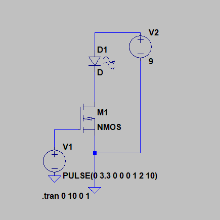
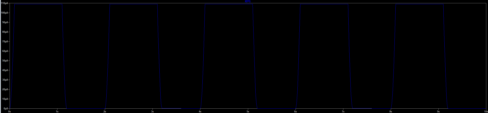

# Lab 6: "High Power" Control
The purpose of this lab is to learn how to deal with high power and how to protect a microcontrollor when dealing with high power.  Nothing in this lab is high power but some things being used have the potential to damage or "brick" a microcontroller.  A 12V power supply is used in this lab with a power resistor attached to a red LED and another resistor attached to a green LED.  These LEDs will help indicate if the microcontroller is being used correctly.

## Relay
Relays are perfect for being a load on a high voltage circuit.  The relay shown below has a 1 Hz input and is being supplied with 9V.
The coil in the relay requires a 1A source (because of its internal resistance) to change the switch.  A MOSFET is used to drive the relay, since we did not want current going into/out of the processor. Experimentally, it is determined that the maximum switching speed of the relay is around 90-110 Hz.
Once it reaches these speeds, the coil does not actually switch, and stays locked on one side of the relay.

## MOSFET Switch
An NMOS transistor is used as a low side switch. The circuit configuration can be seen below:

The simulation results for this set up can also be seen below:

Since this circuit will be used extensively in the upcoming labs, a picture of this circuit will be provided in a later exercise.

##Code
The code for this part is fairly simple. It is just a standard PWM generation.