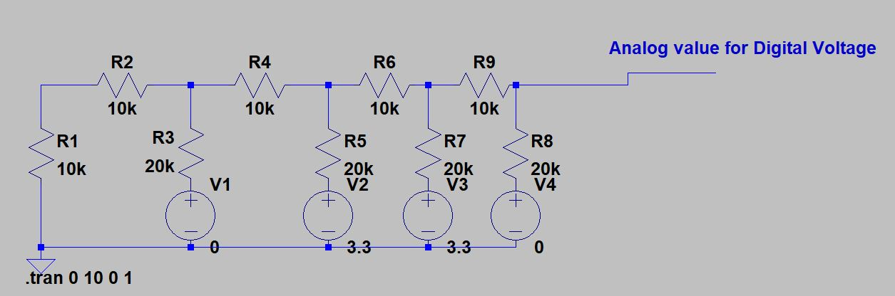
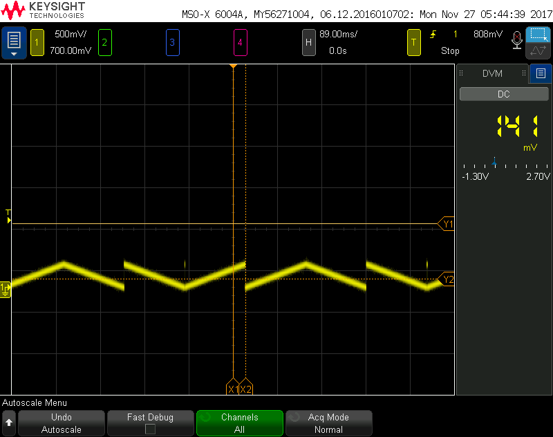
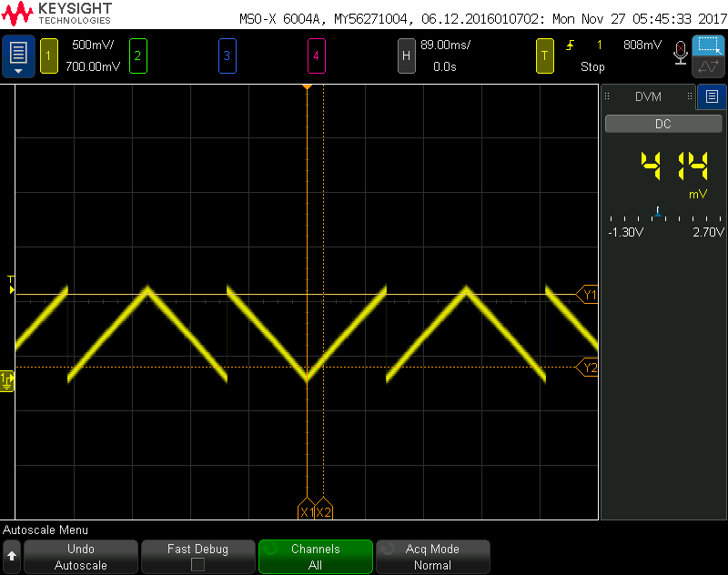
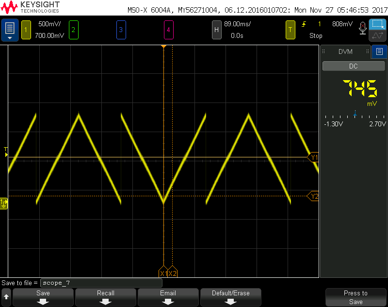
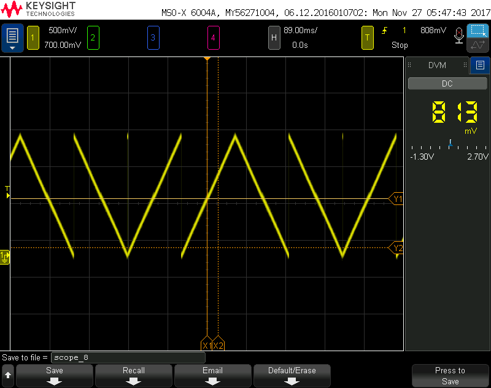

# Lab 6: Precision Control

# Precision Control
In this project, we are attempting to control the output voltage of the MSP430F5529. We do this by performing a Digital to Analog Conversion (DAC), and then observing the loading effects that occur from placing various resistance at the output.

## PWM Part 2
In order to generate an analog voltage from a PWM, a passive low pass filter is constructed. the schematic for this low pass filter can be seen below, followed by the resulting waveform. 

## R2R DAC 
Next, a simple implementation of a DAC is done, a resistor to resistor network. The schematic can be seen below:

Note, that this schematic can be repeated over and over to get as many bits as desired. In this case, we desire an 8 bit DAC, so we add 4 more voltage source and resistor combinations. The outputs to various signals can be seen below:

Output from binary 127.

Output from binary 51.

In order to accomplish this, 8 GPIO pins are set, and each pin acts as a different bit in the binary number.
Next, in order to demonstrate that we can produce 256 discrete voltages, triangle waves are made, by treating the 8 GPIO pins as a binary counter, and incrementing them. The output can be seen below:

## Loading effects
Finally, the effects of loading the output with a resistor of 100, 1k, 10k, and 100k are examined. The outputs can be seen below:

As the load resistance gets higher, there appears to be less voltage drop across the resistor, as current lessens as the resistance increases.

## Code
The code for this portion was fairly simple. We simply set each of the 8 GPIO pins to output. The pins are then set high or low based on a counter. Since we use 7 pins of port 6, we can simply increment the Port 6 output register, until we hit 127, at which point
we need to set the 8th pin as high, and then continue counting up.